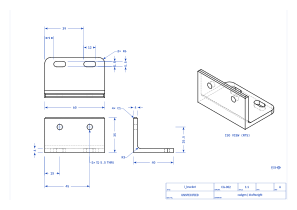

# cadjson

CAD as text. A part is one JSON file: named dimensions, an ordered list of features, and the
outputs you want. `cadjson` builds it with the OpenCascade kernel and writes STEP for any CAD
package, STL and 3MF for printing, 2D drawings with hidden lines, section views, an annotated
drawing sheet, PNG previews, an HTML viewer to turn the model around in a browser, a Fusion 360
script that rebuilds the part with a native timeline, and a `report.json` with the numbers. Because the source is text, parts live in git, diff
cleanly, and can be written or edited by an AI. The repo ships a Claude Code skill for that.

<p align="center">
  
</p>

```jsonc
{ "schema": "cadjson/0.1", "name": "l_bracket", "units": "mm",
  "params": { "width": 60, "base_len": 40, "wall_h": 35, "t": 4, "hole_d": 5.5 },
  "features": [
    { "id": "profile", "type": "extrude", "distance": "width",
      "sketch": { "plane": "YZ", "shapes": [ { "type": "path", "start": [0, 0],
        "segments": [ "right base_len", "up t", "left base_len - t", "up wall_h - t", "left t", "close" ] } ] } },
    { "id": "inside_fillet", "type": "fillet", "radius": 3,
      "edges": { "of": "profile", "parallel_to": "X", "near": ["width / 2", "t", "t"] } },
    { "id": "wall_holes", "type": "hole", "face": { "of": "profile", "normal": "-Y" },
      "at": [[-15, 8], [15, 8]], "diameter": "hole_d", "through": true }
  ],
  "outputs": { "step": true, "stl": true, "drawing": { "sheet": true, "dimensions": true } } }
```

## Install

Python 3.11 or newer. Wheels exist for Windows, Linux and macOS.

```
pip install "cadjson @ git+https://github.com/sclaiborne/CAD-Generator@v0.3.2"
pip install "cadjson[sheets] @ git+https://github.com/sclaiborne/CAD-Generator@v0.3.2"   # + dimensioned sheets
```

## Use

```
cadjson validate part.json          # schema and params, no geometry
cadjson build part.json             # STEP, STL, views, previews, report -> out/<name>/
cadjson build part.json --sheet     # plus the annotated drawing sheet (needs [sheets])
cadjson view part.json              # build and open the model in the browser (orbit, hide parts, sections)
cadjson info part.json              # every face and edge, for writing selectors
cadjson compare part.json ref.stl   # volume, bbox and surface distance vs a reference mesh
cadjson export-fusion part.json     # Fusion 360 script with a native parametric timeline
cadjson export-python part.json     # the equivalent standalone build123d script
cadjson init my-parts               # scaffold a parts repository, Claude skill included
```

## What it covers

Features: extrude, revolve, fillet, chamfer, shell, holes (plain, counterbore, countersink,
or a standard thread size such as `M3` / `#6-32` with tap or clearance fit), real ISO threads,
mirror, linear and polar patterns, loft, sweep, text, imported parts, assemblies positioned
by mates (coaxial, against, flush, parallel) with interference and clearance checks.
Sketch shapes: rectangle (optionally rounded), circle, slot, polygon, points, path of
relative moves and arcs, text, with add/subtract and linear/polar/grid patterns.
Selectors pick faces and edges by the feature that made them, normal, direction, convexity,
geometry type, size or proximity, never by index. Variants inherit a base part with
`extends`; new feature types come from plugins.

Format reference: [docs/schema-v0.md](docs/schema-v0.md). Fusion export:
[docs/fusion-export.md](docs/fusion-export.md). Variants and plugins:
[docs/extending.md](docs/extending.md). Options survey and plan: [PLANNING.md](PLANNING.md).
Fifteen example parts with previews live in [examples/](examples/).

## Status

Version 0.3.2. Everything above builds and is covered by tests on Windows and Linux. Known
limits: the Fusion export is verified against a fake API, not yet inside Fusion; sketch
geometry in the Fusion script is numeric (parameters drive feature values, not sketch
dimensions); sheets dimension automatically with no way to request a specific dimension;
section views use a grey fill rather than hatching; threads, loft, sweep, text and assemblies
are not exported to Fusion.

## Working with Claude Code

`.claude/skills/cadjson/SKILL.md` teaches Claude the format and the workflow: write the
JSON, validate, build, read the report and look at the previews, fix selector errors with
`info`. `cadjson init` copies the skill into a parts repository. Parts you would rather not
publish belong in a repository of their own, not here.

## Licensing

cadjson is MIT. Its geometry dependencies (build123d, bd_warehouse, trimesh, pydantic, click)
are Apache-2.0 or MIT. Dimensioned drawing sheets use **draftwright, which is AGPL-3**; it is
an optional extra so that installing cadjson does not pull it in. If you install `[sheets]`
and redistribute the combination, the AGPL applies to that combination.

## Layout

```
cadjson/       package: schema, expressions, planes, sketches, selectors, builder, exports, CLI
docs/          format reference, Fusion export, extending
examples/      example parts, previews, an example plugin
schema/        generated JSON Schema (cadjson schema -o schema/cadjson-0.1.schema.json)
tests/
experiments/   throwaway scripts that verified the toolchain during development
```
